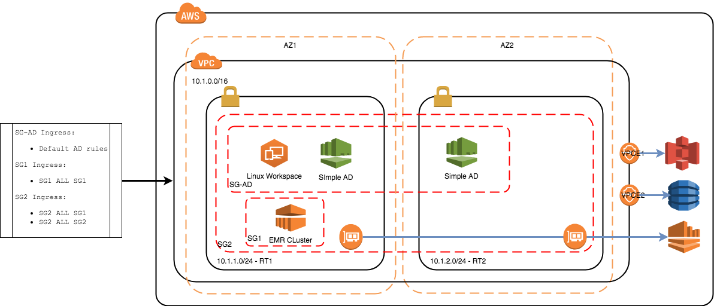
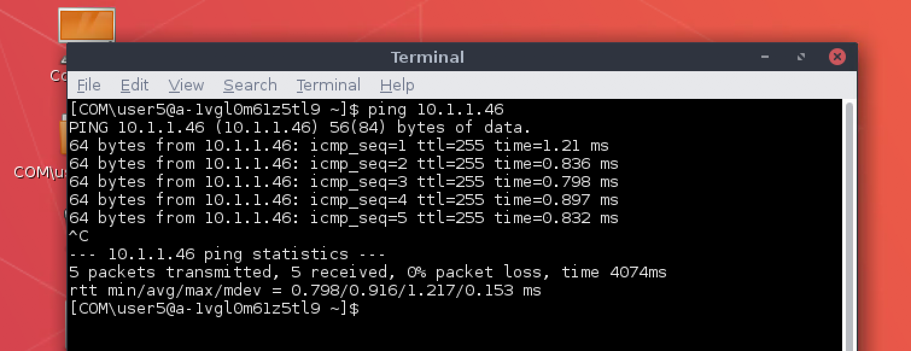

# AWS / Terraform Data Science Environment

This is an attempt at creating an AWS environment whose objectives are to create a powerful yet safe data science development environment that avoids data extrication at all costs.

In this example a private VPC is created with 2 subnets and no internet access.
An EMR spark cluster is stood up with 3 nodes, in order to achieve this a S3 endpoint
is created in order access the appropriate Hadoop resources.



## Set-Up

You will need the following tools and accounts to make it happen

### AWS Account

You will need an AWS account, if you don't have one then just [Sign-Up](https://aws.amazon.com/free)
You will need a development user with admin access and security access keys in order to use the AWS CLI

Install the [AWS CLI](https://aws.amazon.com/cli/) and set-up a profile using your access keys

### Terraform

Install terraform command line tool. Depends on your OS, [Install Terraform](https://www.terraform.io/intro/getting-started/install.html) has some descent instructions.

If you are using OSX I suggest you use [Homebrew](https://brew.sh/) to install the terraform package.

## Building / Running

### Plan

I suggest that you run a plan to determine that access to your AWS account is as expected.
Run the following command in the root of the terraform source _src/main/terraform_
Note that it is recommended that you override the default values for _aws_profile_.

```commandline
terraform plan -var "aws_profile=your-profile -var "aws_region=eu-west-1" -var "aws_directory_password=your-dir-password"
```

### Apply

Once you are happy with the plan apply and decided on what variables to override you can apply your plan e.g.

```commandline
terraform apply -var "aws_profile=your-profile" -var "aws_region=eu-west-1" -var "aws_directory_password=your-dir-password"
```

### Manual

To create the actual workspace we will revert to using the console and doing this manually.
Unfortunately terraform/cloudformation do not fully support creation of workspaces,
undoubtedly there is a way of automating this through the use of Lambdas or API (boto3)
but this is beyond the scope of this PoC

1. Login in to the AWS console, open the workspaces service, make sure the region is the correct one
2. Select Directories, there should be a directory created by terraform, select it and then actions and then update details
3. Under the security groups section, select security group 2 e.g. _data_science_dev_sg_2_, then update and exist. We do this so that the work space created in the next steps get's access to the EMR cluster
4. Select WorkSpaces and the Launch WorkSpaces, there are 5 steps to work through
   1. Select the directory that was created
   2. Create a user that will access the workspace, this can be anything, make sure you put in an email address that you are able to access. Login instructions will be sent to this address.
   3. Select the bundle, note that the bundles on offer are the defaults that get registered in  the directory, we can create our own bundle, for the purposes of this example select Performance Amazon Linux 2
   4. Workspace configuration, defaults will do, if you feel like encrypting the volumes, go for your life, obviously it is the best practice to do this
   5. Review and launch your workspace. This should take about 5 to 10 mins
5. Check you email, you should have received instructions on how to set-up your user credentials and the desktop application that effectively acts as your citrix host.
6. Login to workspace using the workspaces application


### Testing

#### Internet Connectivity

The workspace you created is accessible from your desktop via the internet, note that the workspace can be restricted to only accept connections from specific IP addresses, this is beyond the scope of this PoC but it can be done.
You will test that once you are connected to the workspace you can not browse the internet.
Try the following command from a terminal window in the workspace (or use a browser)


```commandline
curl -I -m 5 http://www.google.com
```

You should get a timeout after 5 seconds

#### EMR Connectivity

Your workspace has 2 NIC's, one for you to access the workspace via PCoIP and the other is attached to your VPC.
Your workspace has been convieniently placed in the same security group as your EMR cluster,
you should be able to connect to any node in your cluster to your hearts content.
Try pinging the master node, here is an example.



### Next Steps

The following are some suggested next step activities and experimentation

#### Data Extrication

There have been 3 VPC endpoints created in this example.
S3 is a good one to try and access, there are various controls we can put in place. AWS command line tool is installed on the linux image by default.
As an experiment try and create a private bucket that and extract data from it using the terminal.

Cut and paste from desktop to workspace and back again is on by default, this should be turned off, it is possible and it should be turned off, I will leave that to you to experiment with.

#### Developer Environment

The workspace is the good starting point for a developer environment.
The default linux environment is pre-built with some useful tools such as java and python but it will need more e.g. IntelliJ, pip, maven e.t.c.
It is possible to build a bundle with all the tools you need, once again, a good next step.

Accessing libraries on the other hand can be done in a number of ways, S3 is one or we could route to a controlled binary store like nexus or a proxy, there are lots of options, the point being, that it is controlled by the VPC the workspace resides in.

### Destroy

Clean up your environment by destroying, this will remove all traces.
Before you destroy, you will need to delete your workspace, as this was a manual process.

1. Quit from any open workspace open up the AWS console and navigate to the WorkSpaces services
2. Select Directories, select it and then actions and then update details
3. Under the security groups section, remove the existing security group and update and exist
4. Select the directory and in the actions deregister the directory
5. Select the WorkSpaces you created and from the actions, remove workspaces.
6. Wait until the WorkSpaces are removed, then run the following command to clean up the environment-

```commandline
terraform destroy -var "aws_profile=your-profile -var "aws_region=eu-west-1" -var "aws_directory_password=your-dir-password"
```

### Troubleshooting

TODO - add FAQ for potential issues
